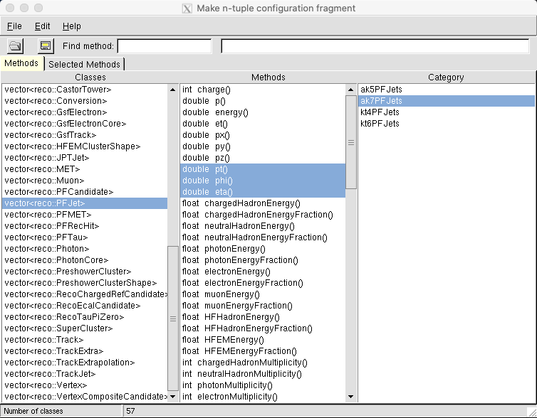

TheNtupleMaker
==============

## Contents
1. [Introduction](#introduction)
2. [Documentation](#documentation)
3. [Installation](#installation)
4. [Tutorial](#tutorial)


"Any intelligent fool can make things bigger, more complex, and more violent. It takes a touch of genius, and a lot of courage, to move in the opposite direction."  
*E. F. Schumacher*


## Introduction <a name="introduction"></a>

__TheNtupleMaker__ (TNM) is a tool that automates the creation of simple [ROOT](http://root.cern.ch) ntuples from data in the (EDM) format developed and used by the [CMS Collaboration](https://cms.cern/). In particular, TNM can be run on CMS mini Analysis Object Data (miniAOD) files.  It also automatically generates a __C++__ and __Python__ analyzer skeleton programs that can be the basis of code for analyzing the contents of the ntuples. 
This version of TNM works with miniAODs built with __ROOT 6__, therefore, it is compatible with all versions of CMSSW (https://github.com/cms-sw/cmssw), the CMS Collaboration's codebase, which depends on ROOT 6.  (The older __ROOT 5__ version is under the master branch.)

In spite of the complexity of the data formats used by collaborations such as CMS, and our quarter-centruy infatuation with object oriented programming and C++ objects, in particular, the data that are ultimately used in a physics analysis are simply a collection of numbers each of which is in one-to-one correspondence with an access function that returns the datum: a simple type, typically, a floating point number or an integer. This may require indirection; for example, the __reco::PFTau__ class in CMSSW has a method called `jetRef()` that returns a C++ object, but the latter has a method that returns the charged hadron energy. Consequently, we can access that number using the *compound method* `jetRef()->chargedHadronEnergy()`. Sekmen argued [](https://indico.cern.ch/event/959859/3_5), therefore, that a tool should be built that makes it possible for a user to call automatically any combination of these access functions, which ultimately return simple types, and thereby create the desired combination of data packaged in a ROOT file. In CMSSW these access functions number in the thousands. 

TNM, which was developed by Harrison Prosper and Sezen Sekmen starting in 2009, is the first realization of this idea and the first step towards the ultimate goal of creating an online portal, with something like TNM as a backend, in which access to particle physics data would be a matter of making intuitive queries about what data are available, learning their provenance and meaning, selecting them, pressing a button and creating an ntuple that can be transparently accessed using ROOT or whatever ROOT evolves into.

## Documentation <a name="documentation"></a>

Detailed documentation of TNM including installation instructions and simple and advanced use cases is
provided in [TheNtupleMaker.pdf](https://github.com/hbprosper/TheNtupleMaker/blob/master/docs/TheNtupleMaker.pdf) (also found under docs/).

__DOCUMENTATION__ TO DO UPDATED

## Installation <a name="installation"></a>

Here, instructions are provided for installing TNM within a [docker](https://www.docker.com/) container (a secure software environment isolated from the host), specifically one that provides access to the CMS [open data](http://opendata.cern.ch/) consistent with CMSSW version CMSSW_5_3_32. (Note that TNM can be used with any version of CMSSW built using ROOT 5.)
The instructions are for a Mac, which in addition to __docker__ requires an installation of __[XQuartz](https://www.xquartz.org/)__. When active, XQuartz makes it possible for graphical user interfaces to be used within a docker container (that is, it provides X11 forwarding).

### 1. Configure XQuartz
Run XQuartz (which is located in Applications/Utilities). Click on the XQuartz menu item (generally, at the left of the menubar), then select *Preferences*. Under the *Security* tabe check *Allow connections from network clients*. Exit XQuartz and re-run it to ensure that the settings have taken effect. Now open a terminal window. In that window, be sure to make the host name of your laptop known to X11 using the command 
```bash
xhost + `hostname`
```
If that does not work, try restarting your Mac, restart the docker daemon if it doesn't start at boot time as well as XQuartz, and try again. (Note that the host name may already be known to X11. You can see this by executing the command `xhost` and checking the listing. The host name, if listed, may be in lowercase but this does not seem to matter.)

### 2. Create and run a docker container

In the new terminal window create a container, here called *testme*, using the image *cmsopendata/cmssw_5_3_32*. (Of course, you can choose whatever name you like for the container. By the way, to remove a container do `docker rm <container-name>`.)
```bash
docker run -it -v $HOME/.ssh:/home/cmsur/.ssh -v $HOME/.Xauthority:/home/cmsusr/.Xauthority -v $HOME:/home/cmsusr/hosthome --net=host --env="DISPLAY=`hostname`:0" --name testme cmsopendata/cmssw_5_3_32 /bin/bash
```
The table below briefly describes the various switches used with the docker command. Note the use of backslashes with the command __hostname__.

| __switch__                   | __description__     |
| :---          | :--- |
-it     | run container in interactive mode |
-v $HOME/.ssh:/home/cmsur/.ssh          | mount the host's .ssh folder at the container mount point of the same name |
-v $HOME/.Xauthority:/home/cmsusr/.Xauthority | mount the host's .Xauthority folder at the container mount point of the same name | 
-v $HOME:/home/cmsusr/hosthome | mount the home folder of the host at container mount point hostname |
--net=host | allow network connections via host |
--env="DISPLAY=\`hostname\`:0" | set environment variable DISPLAY in container to the host name |
--name tnm | name of container |
cmsopendata/cmssw_5_3_32 | image to run |
/bin/bash | shell to be used in container |

You may want to add the following commands to `.bash_profile` in your container
```bash
alias ls="ls --color"
PS1="docker/\W> "
```
and do `source ~/.bash_profile` to tidy up the command line prompt. You should already be in `$HOME/CMSSW_3_5_32/src` and the command `cmsenv` may have already been executed while in that folder. If not, `cd` to that fold and execute the command `cmsenv`. Then, to check that the X11 forwarding is working execute the command `root`. The `root` splash screen should appear. If it does, X11 forwarding is working.

### Download and build TheNtupleMaker

Make sure you are in the folder `$HOME/CMSSW_5_3_32/src` before executing the command `cmsenv` in order to set up the CMSSW environment. Then do
```bash
mkdir PhysicsTools
git clone git://github.com/hbprosper/TheNtupleMaker
cd TheNtupleMaker
```
CMSSW Data formats are slightly version-dependent. But, TNM is designed to be version-independent, which is achieved by running the command
```bash
scripts/initTNM.py
```
This script makes a valiant attempt to guess which of the hundreds of C++ classes are most likely to be of interest to those doing physics analysis.  TNM can now be built using the command below
```bash
scram b -j K
```
where *K* should be replaced with the number of cores at your disposal. If you don't know just omit the `-j` switch. If the build succeeds, which should take a few to about 10 minutes, you are ready to use TNM.

## Tutorial

To configure the ntuple contents, you will need a sample from the EDM data from which you intend to make the ntuple.  The ROOT file needs to be either in your local area, or a soft link must be created (e.g. with the command `ln -s path-to-root-file myEDMsample.root`).  If you do not already have a sample locally, it is very easy to copy a sample with a small number of events from data in CMS storage locations using [this configuration file](https://twiki.cern.ch/twiki/bin/view/CMSPublic/WorkBookDataSamples#Copy_Data_Locally).

The first thing to do is create, either by hand or better still using the script __mkntuplecfi.py__, a configuration specifying which methods are to be called to extract the desired data from the the EDM file. The script __mkntuplecfi.py__ allows you to make a first pass at building the configuration file. Run the command

```bash
makentuplecfi.py 
```
and, in the GUI that appears, open myEDMsample.root using "File --> Open" or using the dedicated file open button on the top left.  
The GUI would look like this:



The methods to be called by TNM are selected (or deselected) from the __Methods__ tab, while the __Selected Methods__ tab can be used to check which methods have been selected. To select a method, first select a class from the list of __Classes__, select one or more methods, and select one or more categories from the list __Category__. For example, in the figure above, we have selected the class __vector<reco::PFJet>__, the methods __pt()__, __eta()__, and __phi()__, and the category __ak7PFJets__, that is, jets created with the anti-kT algorithm with a cone size of 0.7. Repeat the selection for all the methods of interest, then Save the file  with the default name of __ntuple_cfi.py__ to the local __python__ folder. Once a configuration file has been created, it can be edited by hand. *Note*: the GUI is just an aid; it does not list every possible method known to TNM, but just the ones that are most likely to be of interest. You are free to add methods, by hand, to the configuration file created using the GUI. If  you add a method that is  not known to TNM, the latter will warn you at runtime. 

When __mkntuplecfi.py__ runs for the first time, it creates three folders __methods__, __txt__, and __html__. The __methods__ folder lists the accessor methods of a subset of the available CMSSW clases, those most likely to be of interest. The folders __txt__ and __html__ provide similar information but in different formats. Here is an exhaustive listing of all access methods of the CMSSW class [reco::PFJet](http://hbprosper.github.io/TheNtupleMaker/DataFormats.JetReco.PFJet.PFJet.html). (Tip: use Command + click to open any link in another tab.)

You can look at __python/ntuple_cfi.py__ to see the ntuple content.  As mentioned earlier, the GUI is just a tool to automate the creation of this configuration.  Once you have a starter __python/ntuple_cfi.py__, you can modify it by hand to extend its content.  You can also save __ntuple_cfi.py__ with a different name.  However, you must make sure that the name change is propagated to __TheNtupleMaker_cfg.py__ in order for TNM to know which ntuple content configuration to work with.

### Runing TNM

Simply do
```bash
cmsRun TheNtupleMake_cfg.py
```
after appropriate editing of __python/ntuple_cfi.py__ and __TheNtupleMaker_cfg.py__. Upon completion of the run, you will see a ROOT file called, by default __ntuple.root__, and a folder called, by default, __analyzer__ (these can be changed from within __python/ntuple_cfi.py__). The analyzer folder contains the skeleton analysis programs in C++ and Python. Check that all is well by doing the following
```bash
cd analyzer
source setup.sh
make
echo ../ntuple.root > filelist.txt
./analyzer  
```
and also try the Python version
```bash
./analyzer.py
```
If all goes well, you will find the file __analyzer_histograms.root__, which of course will be empty since you've not done anything yet!

### Interface with ADL

We are currently taking the analysis code generation one step further.  We are developing a tool that will automatically produce a complete analysis code given the description of the analysis writtien using the domain specific analysis description language [ADL](http://adl.web.cern.ch/index.html).  A prototype tool, a transpiler called __adl2tnm__, has been developed that can automatically produce a complete, executable, analysis code given an ntuple.root and the analysis description written in ADL without any need for programming.  More information can be found in the [adl2tnm github repository](https://github.com/hbprosper/adl2tnm). Note this tool is still very much at the proof of principle stage!


